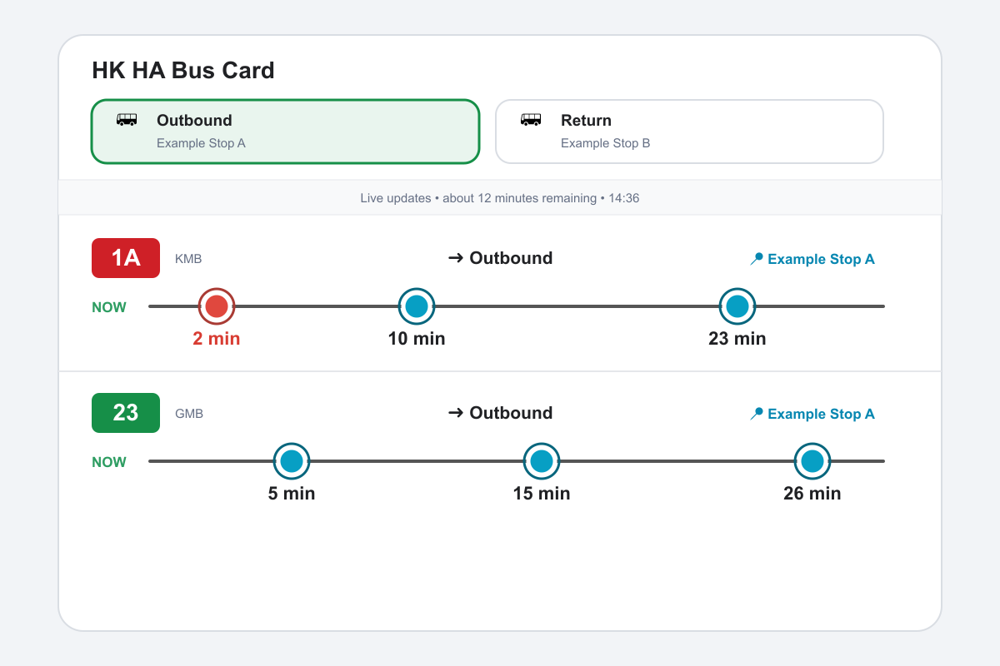

**廣東話** | [English](README.en.md)

# HK HA Bus Card

Home Assistant Custom Card 可以直接查詢香港九巴、城巴、嶼巴、專線小巴嘅到站時間。
以方便經常查詢指定地點, 指定路線的到站時間



## 功能

- 先輸入路線號碼，再搜尋所有支援嘅營辦商
- 從官方路線資料選擇實際行車方向同巴士站
- 自動識別及合併九巴＋城巴聯營路線嘅 ETA
- 聯營線嘅九巴特別／短程班次會保留喺同一個路線群組
- 顯示站名直接來自所選路線嘅官方巴士站資料
- 開啟 Dashboard 時唔會自動查詢，必須撳方向按鈕先開始
- 查詢啟動後會定時更新，預設 15 分鐘後自動停止
- 可以設定 ETA 顯示範圍、最多路線、每線班次數目同更新間隔
- 路線按最快到站時間排序
- 方向按鈕副標題會列出已選路線，並按路線號碼由小至大排列
- Card 內會隱藏站名結尾嘅官方站碼，但保留完整實際站名
- 已選方向按鈕使用實色主題色，與未選按鈕有清晰對比
- 查詢進行期間可使用狀態列左邊嘅「停止更新」按鈕立即停止
- 手動停止或 Session 過期後，已選方向按鈕會自動回復未選狀態

## 使用 HACS 安裝

1. 開啟 HACS，撳右上角選單，再選擇 **Custom repositories**。
2. 加入呢個 GitHub Repository，Category 選擇 **Dashboard**。
3. 下載 **HK HA Bus Card**。
4. 去 **Settings > Dashboards > Resources**，確認有以下 JavaScript Module：

   ```text
   /hacsfiles/hk-ha-bus-card/hk-ha-bus-card.js
   ```

5. 清除瀏覽器快取並重新載入 Home Assistant，之後喺 Card Picker 加入
   **HK HA Bus Card**。

## 手動安裝

1. 建立資料夾，將 `hk-ha-bus-card.js` 放到：

   ```text
   /config/www/community/hk-ha-bus-card/hk-ha-bus-card.js
   ```

2. 去 **Settings > Dashboards > Resources**，加入 JavaScript Module：

   ```text
   /local/community/hk-ha-bus-card/hk-ha-bus-card.js?v=1.3.4
   ```

3. 清除瀏覽器快取並重新載入。Home Assistant Companion App 如仍然使用
   舊版本，請完全關閉 App 後再開。

4. 喺 Card Picker 加入 **HK HA Bus Card**，再使用圖像化編輯器加入最少
   一個方向、路線同巴士站。

最簡設定：

```yaml
type: custom:hk-ha-bus-card
title: HK HA Bus Card
session_key: auto
update_interval: 30
session_minutes: 15
display_window: 30
max_routes: 3
max_arrivals: 3
directions: []
```

Card 預設使用 `directions: []`，請透過圖像化編輯器設定自己嘅路線，
唔好直接複製其他使用者嘅路線及巴士站 ID。

## Card Editor 使用方法

每個查詢方向嘅設定步驟：

1. 輸入方向按鈕名稱，例如「返屋企」或「去公司」。
2. 輸入巴士路線，再撳 **搜尋營辦商**。
3. 如果路線號碼屬於幾個無關營辦商，先選擇九巴、城巴、專線小巴或
   嶼巴。117、118 等九巴＋城巴聯營線會自動歸入同一群組，毋須分開選擇
   九巴或城巴。
4. 選擇路線嘅實際行車方向及巴士站。
5. 撳 **加入這條路線**。

部分聯營路線會由官方 API 提供九巴獨營嘅特別或短程班次，例如 118
由旺角、紅隧或柴灣開出嘅班次。呢啲班次仍會顯示喺同一個聯營路線群組
嘅「路線方向」選單；如果揀咗九巴獨營班次，結果行會正確顯示「九巴」。

Card 會儲存所選路線巴士站嘅官方名稱。唔需要手動輸入共用站名，同一個
方向內嘅不同路線亦可以選擇不同巴士站。

最上方設定嘅方向名稱只會用喺查詢按鈕。每條結果路線顯示嘅方向，會使用
該路線官方資料入面嘅實際目的地。

編輯器只會呼叫路線及巴士站搜尋 API，唔會啟動 ETA 定時查詢。正常 ETA
查詢仍然要喺 Dashboard 撳方向按鈕先會開始。

## 設定選項

| 選項 | 預設值 | 說明 |
| --- | ---: | --- |
| `title` | `HK HA Bus Card` | Card 標題 |
| `session_key` | `auto` | 自動按每張 Card 嘅方向及路線分隔查詢 Session |
| `update_interval` | `30` | 更新間隔秒數，最低 10 秒 |
| `session_minutes` | `15` | 幾多分鐘後自動停止查詢 |
| `display_window` | `30` | 只顯示呢個分鐘範圍內嘅班次 |
| `max_routes` | `3` | 只顯示最快到達嘅路線數目 |
| `max_arrivals` | `3` | 每條路線最多顯示幾班車 |
| `directions` | `[]` | 由 Card Editor 建立嘅方向及路線設定 |

使用 `auto` 時，方向或路線設定不同嘅 Card 會自動獨立查詢；同一張 Card
切換 View 或重新載入後，仍然可以接駁原有 Session。如果想刻意令幾張 Card
共用查詢，先為佢哋手動設定相同 `session_key`；設定不同 Key 就會保持獨立。

## 查詢運作方式

- 冇已儲存 Session 時，載入 Card 唔會發出任何 ETA 請求。
- 撳方向按鈕後會立即查詢，之後按設定間隔更新。
- 重複撳同一按鈕或轉換方向，會取消舊請求並重新計算 Session 時間。
- 撳狀態列左邊嘅 **停止更新**，會立即取消現有請求及停止之後嘅更新。
- 查詢狀態會保留喺頁面全域 Owner，並同步到 `sessionStorage`，所以同一個
  瀏覽器分頁切換 View 或重新載入 Home Assistant 後仍可恢復。
- Session 過期後會停止更新，亦唔會自動重新啟動。
- 每個瀏覽器分頁或裝置各自擁有 Session。關閉分頁、清除網站資料、登出
  或使用私人瀏覽模式，都可能令 Session 結束。

如果需要跨裝置共用、或者所有瀏覽器關閉後仍然繼續查詢，就要將查詢排程
保留喺 Home Assistant 或 Node-RED。

## 常見問題

- **顯示 Custom element doesn't exist**：檢查 Resource 路徑，然後清除
  瀏覽器快取並重新載入。
- **仍然載入舊 Card**：增加 Resource URL 後面嘅版本號，例如
  `/local/community/hk-ha-bus-card/hk-ha-bus-card.js?v=1.3.5`。
- **不同頁面嘅 Card 顯示同一個查詢結果**：升級至 1.3.2 或以上，並將
  `session_key` 設成 `auto`。舊預設值 `hk_ha_bus_card` 亦會自動當成
  `auto` 處理。
- **Sections View 入面 Card 被裁切**：進入 Dashboard 編輯模式，開啟 Card
  選單並選擇 **Reset size**。如果 YAML 內有已儲存嘅
  `grid_options.rows`，請移除 `rows`。
- **某部裝置無法查詢 ETA**：檢查瀏覽器、DNS 或網絡有冇封鎖
  `data.etabus.gov.hk`、`data.etagmb.gov.hk` 或 `rt.data.gov.hk`。
- **冇方向按鈕**：開啟 Card Editor 加入方向及路線；本項目刻意唔提供
  預設方向。
